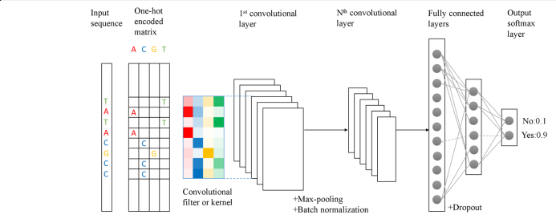

\fontsize{9}{20}

# Introduction

Melanoma is an aggressive cancer with a high level of therapy-resistance due to its high degree of heterogeneity and plasticity. Despite the great efforts put into the field of melanoma treatment, resulting in great advances, many challenges remain. The major challange in fighting melanoma relapse continues to be the tumor heterogeneity, as melanoma comprises a wide variety of phenotypically distinct subpopulations of cancer cells. To be able to adress this issue therapeutically, the underlying mechanisms of heterogeneity need to be characterized. In this paper, a distinction between two major types of melanoma cells is made: invasive and proliferative [@Verfaillie; @Shannan].

Transcriptional reprogramming of melanoma cells in proliferative state into melanoma cells with invasive characteristics is a critical event at the origin of metastatic spreading of melanoma. Invasive cells have acquired the ability to migrate to other tissues, enter the bloodstream and therefore lie at the basis of the metastatic spreading of cancer in the body. While the transitional mechanisms from proliferative to invasive cancer cell are yet to be characterized more extensively, it is sure that one event lies at the basis of this transition: the transcriptional reprogramming of the cell. Studying the involved genes and regulatory elements using various bioinformatics approaches is therefore a hot topic in the area of melanoma research. Decoding the regulatory landscape could result into the ability to push melanoma cells towards a different cell state, which would be an interesting target from a therapeutic point of view [@Verfaillie].

Transcriptomic, open chromatin and histone modification maps of melanoma cultures were constructed, revealing thousands of active cis-regulatory regions, both for proliferative and invasive cells [@Verfaillie]. It should be possible to discern which cis-regulatory regions are useful for the classification of cell states in melanoma samples if such states are truly distinct in terms of regulatory landscape. The aim of the project was the construction of classifiers predicting whether a regulatory region would be active in proliferative or invasive cell states. Another useful insight that would be gained from these classifiers, is which regulatory regions are the most significant for distinguishing between cell states, thus giving information about the underlying mechanisms and the critical genes and regulatory elements involved in cancer cell state transitions. 

Two distinct machine learning techniques were used for the creation of such classifiers, namely the random forests ensemble method and deep learning, with the use of convolutional neural networks. Random forest (RF) is a nonparametric tree-based method that builds an ensemble model from random subsets of features.[@Nguyen] RF has shown excellent performance for classification problems,it works well when the number of features is much larger than the number of samples. However, with randomizing mechanism in feature selection, RF could give poor accuracy when applied to high dimensional data. This is mainly caused by the subspace of features randomly sampled from hundreds of features to split a node of the tree is often dominated by uninformative features (or noise) when growing a tree from the data,. In this manner the tree grown from such subspace of features will result in a low accuracy RF model [@Nguyen]. Aiming at improving the performance of the RF model, we propose a feature selction algorithm before constructing the RF model, called Boruta. Boruta is an all-relevant feature selection method. It tries to capture all the important, interesting features that might be relatively important to the outcome variable.[@Kursa] In addition to the RF method, we also build convolutional neural networks parallelly. A neural network is able to extract features from raw DNA sequences. No prior manual feature selection is necessary. By converting the sequence into a 1-hot vector, it becomes an image-like input which can be scanned with a number of kernels from the first convolutional layer. This information is then passed on to the rest of the network. During training, the network will adjust its weights in order to optimize the classification task. In the process, the kernel weights of the first convolutional layer will start to resemble the various DNA motifs which are then extracted and compared to a motif database (JASPAR) [@Min]. Both models were trained on the same training set, which comprises the dataset of active cis-regulatory regions, mentioned hereabove. In this paper, both methods are described and their results are evaluated and compared.
# Methods

## Deep learning

## Random forests

Unlike neural networks, random forests do not have feature learning integrated into the training process. Thus, they require the input data to have labelled features. Before the application of RFs to our data was possible, we needed a way to discover the features. This limitation also precluded us from training our model on the sequence data.

We therefore had to engineer a pipeline to process the sequence data into a usable form, which took a considerable investment of time. Our reasoning on this front was as follows: the sequences themselves are not the principal target of our learning strategy, but rather whatever recurring motifs may be present.

### Input matrix creation

To this end, we first used the motif discovery utility Hypergeometric Optimization of Motif EnRichment (HOMER), which provides a Perl module \texttt{findMotifs.pl} that allows for the discovery of enriched regulatory motifs in one set of sequences as compared to another set (the background) [@Heinz:2010aa]. This enabled us to find these motifs in the sequences, and crucially, because we want to compare and contrast the Invasive and Proliferative cell states, allowed us to run these two sets of sequences as backgrounds against each other, identifying the most differential motifs and increasing our confidence in the next steps. The results of these two runs can be found in \texttt{HomerOutput}. HOMER analysis both found known motifs and discovered some motifs \textit{de novo}. Every motif is defined in terms of a position weight matrix (PWM).

Having identified the ensemble of differentially enriched motifs in these two cell states compared to each other, we used Cluster-Buster in order to score the Invasive and Proliferative sequence sets for each motif, independently [@Frith:2003aa]. This resulted in a log-likelihood score for every motif against every sequence in the sequence sets. The functions for this step of the analysis can be found in \texttt{motif\_processing\_main.sh}. We proceeded to assemble these into a feature matrix, with every row being the genomic region and every column a particular motif, hereafter referred to as features, with the log-likelihood scores as values in this matrix. We further inserted a \texttt{\_label} column which represented our binary outcome variable, with 0 for Invasive state and 1 for Proliferative state. This step of the analysis can be found in \texttt{feature\_matrices.py}, utilising the \texttt{feature\_matrix\_special} method of the \texttt{cbust\_result} class we created in order to handle the output of Cluster-Buster. We thus produced a complete data matrix for our subsequent random forest classifier training and exploration, with around three hundred features.

### Feature filtering

# Results and discussion

## Comparing 2 deep learning architectures

# References
