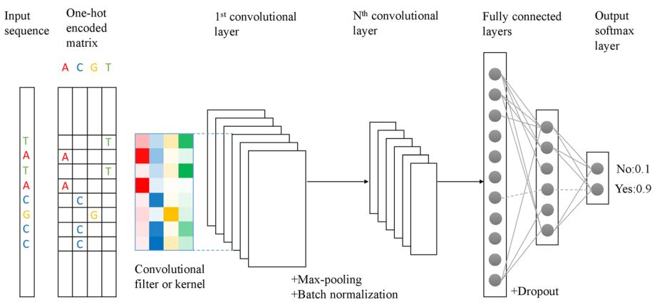
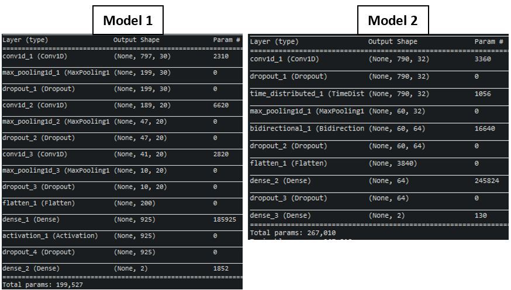
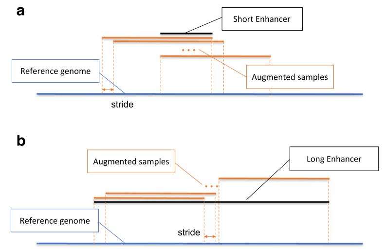
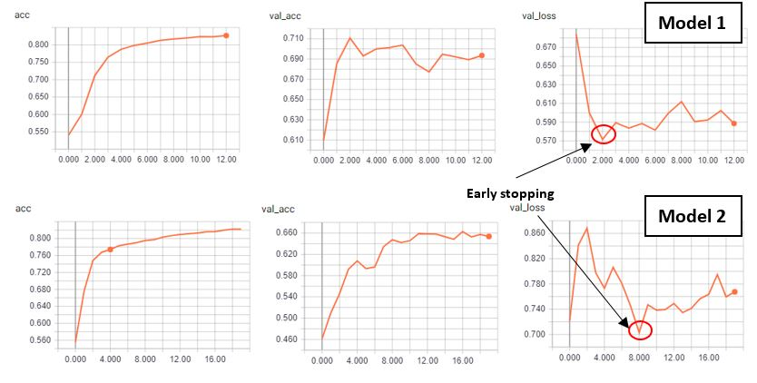
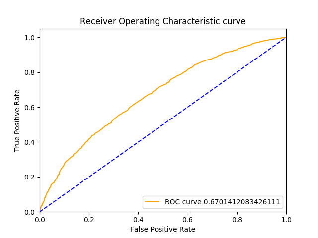
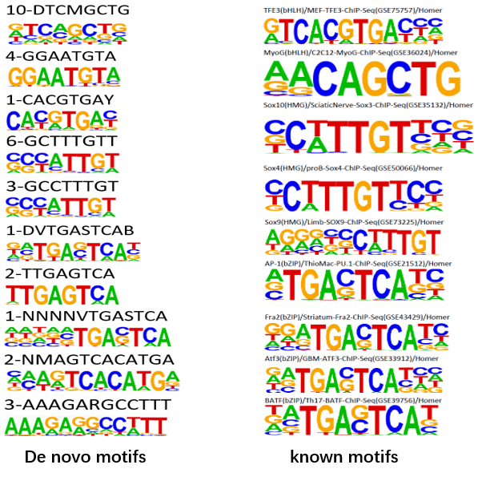
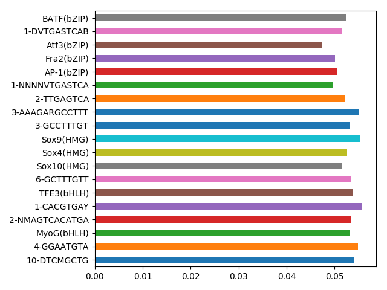
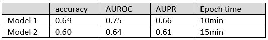
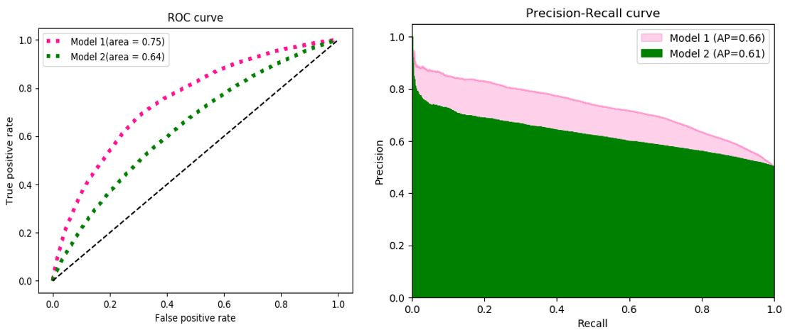
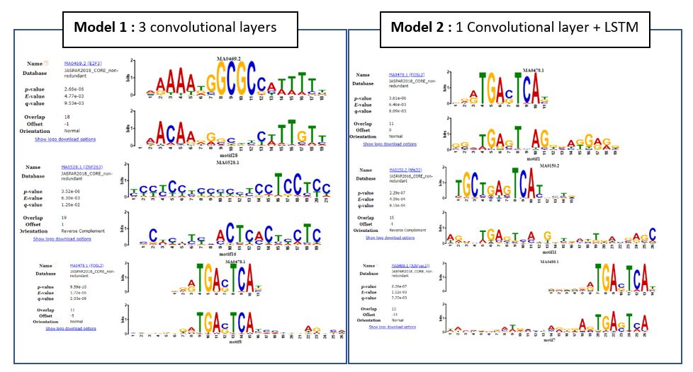

\fontsize{9}{20}

# Introduction

Transcriptional reprogramming of melanoma cells in proliferative state into melanoma cells with invasive characteristics is a critical event at the origin of metastatic spreading of melanoma. Invasive cells have acquired the ability to migrate to other tissues, enter the bloodstream and therefore lie at the basis of the metastatic spreading of cancer in the body. While the transitional mechanisms from proliferative to invasive cancer cell are yet to be characterized more extensively, it is sure that one event lies at the basis of this transition: the transcriptional reprogramming of the cell. Studying the involved genes and regulatory elements using various bioinformatics approaches is therefore a hot topic in the area of melanoma research. Decoding the regulatory landscape could result into the ability to push melanoma cells towards a different cell state, which would be an interesting target from a therapeutic point of view [@Verfaillie].

Transcriptomic, open chromatin and histone modification maps of melanoma cultures were constructed, revealing thousands of active cis-regulatory regions, both for proliferative and invasive cells [@Verfaillie]. It should be possible to discern which cis-regulatory regions are useful for the classification of cell states in melanoma samples if such states are truly distinct in terms of regulatory landscape. The aim of the project was the construction of classifiers predicting whether a regulatory region would be active in proliferative or invasive cell states. Another useful insight that would be gained from these classifiers, is which regulatory regions are the most significant for distinguishing between cell states, thus giving information about the underlying mechanisms and the critical genes and regulatory elements involved in cancer cell state transitions. 

Two distinct machine learning techniques were used for the creation of such classifiers, namely the random forests ensemble method and deep learning, making use of convolutional neural networks. Both models were trained on the same training set, which comprises the dataset of active cis-regulatory regions, mentioned hereabove. In this paper, both methods are described and their results are evaluated and compared.

# Methods

All analysis code and raw data, space-permitting, is available at https://github.com/muscovitebob/EnhancerMachineLearning.

## Random forests

Random forest (RF) is a nonparametric tree-based method that builds an ensemble model from random subsets of features.[@Nguyen] RF has shown excellent performance for classification problems, it works well when the number of features is much larger than the number of samples. However, with its typical randomizing mechanism in feature selection, RF models risk having a poor performance when applied to high dimensional data. The main reason for this is that the RF ensemble method uses subset of features randomly sampled from hundreds of features in each iteration. If such a subset is poorly chosen, the choice of nodes for each decision tree is often dominated by uninformative features. This way, trees grown from such a subspace of uninformative features will result in a RF model yielding poor accuracy [@Nguyen]. Aiming at improving the performance of the RF model, a feature selection algorithm filtering out the uninformative features is used.

As the raw sequence data was not suitable for training the random forests model, a pipeline to process the sequence data into a usable form, i.e. a feature matrix, was engineered, taking a considerable amount of time. However this investment was justified by the fact that the sequences themselves were not the principal target, but rather whatever recurring motifs would be present.

### Motif discovery and scoring

To discover motifs in the input fasta sequences, the motif discovery utility Hypergeometric Optimization of Motif EnRichment (HOMER) was used, providing a Perl module \texttt{findMotifs.pl} that allows for the discovery of enriched regulatory motifs in one set of sequences as compared to another set (the background) [@Heinz:2010aa]. As the goal was to compare and contrast the invasive and proliferative cell states, these two sets of sequences were run as backgrounds against each other, identifying the most differential motifs. The results of these two runs can be found in \texttt{HomerOutput}. HOMER analysis served two purposes: it found known motifs and discovered some \textit{de novo} motifs. The motifs returned by HOMER were formatted as position weight matrices (PWM), representing the relative frequencies of each nucleic acid on each position in the motif.

Having identified the ensemble of differentially enriched motifs in these two cell states compared to each other, the Cluster-Buster software was used in order to score the invasive and proliferative sequence sets for each motif, independently [@Frith:2003aa]. This resulted in a log-likelihood score for every motif against every sequence in the sequence sets. The functions for this step of the analysis can be found in \texttt{motif\_processing\_main.sh}. The set of sequences scored for every motif was then assembled into a feature matrix. In such a feature matrix, every row represents a genomic region and every column represents a particular motif, hereafter referred to as features, with the log-likelihood scores as values in this matrix. A \texttt{\_label} column representing the binary outcome variable was inserted, with value 0 representing the invasive cell state and value 1 representing the proliferative cell state. This step of the analysis can be found in \texttt{feature\_matrices.py}, utilising the \texttt{feature\_matrix\_special} method of the \texttt{cbust\_result} class, created in order to handle the output of Cluster-Buster. Thus, a complete data matrix was produced, formatted correctly to be used as input data for a random forests classifier.

### Train and test set splitting 

There are many more sequences of one class in this dataset - it is unbalanced, and this can influence our model evaluation, especially when present in the test set. We therefore removed 20% of the sequences and set them aside for the test set, balancing the two classes in this set. This test set included the same sequences for both RFs and Deep Learning models. The code for doing this splitting is found in \texttt{select\_subset.py}.

### Feature Selection

The resulting feature matrix contained 333 features, one for each known or \textit{de novo} motif discovered. As mentioned above, RF classifiers tend to perform poorly when trained on datasets containing too many features. Thus, methods to reduce the amount of features in the training data for our classifier were required. Two software packages were used in order to obtain a reduction of the amount of features, called MAST and Boruta.

#### MAST

The Model-based Analysis of Single Cell Transcriptomics (MAST) R package provides methods and models for handling zero-inflated single cell assay data [@McDavid]. For this project, it is used for likelihood ratio testing via its \texttt{LRT} method. This likelihood ratio test is used to detect the most significant differential features between invasive and proliferative cell states. The R script used for this reformatting and running the likelihood ratio test can be found in \texttt{Mast\_reduce.R}. After running the likelihood ratio test on the feature matrix for every motif, the most significantly differentiatial features (P-value lower than 0.05) were selected. The resulting feature matrix contained 164 feature columns.

#### Boruta

Boruta is an all-relevant feature selection method [@Homola]. The algorithm works as follows: first it duplicates the dataset and makes the values shuffling in each column which after that the duplicated dataset is called shadow features. Then an RF classifier is trained on the dataset, from which the importances for each of the features are generated. This is repeated for several iterations (one hundred by default). It trains the original dataset along with the shadow features dataset and checks for each if the real features have higher importance than the best of the shadow features in each iteration. If they do, it records this in a vector of hits and continues on with another iteration. Finally after the predefined set of iterations it generates a table of selected features. This analysis can be found in \texttt{boruta\_reduction.py}.

### Model construction

For the construction of the random forest \texttt{sklearn.ensemble.RandomForestClassifier}, from the \texttt{scikit-learn} library was used. We tested the available parameter space by hand and using \texttt{GridSearchCV}. We found that default parameters worked best in most cases, with the exception of setting \texttt{n\_estimators=1000} - this is the number of trees in a forest, and additionally balancing the training sets using \texttt{class\_weight='balanced'}, which weights the majority and minority classes according to their proportions [@Srivastava]. Apart from \texttt{RandomForestClassifier}, some other classifiers were tried from the same family.

## Deep learning

### Two architectures

A schematic outline of how a neural network can be used in motif detection is given in [@fig:deeplearningsetup]. After transformation to a 1-hot representation, the DNA sequences can be inputted into a first convolutional layer. Here a number of kernels, acting as motif scanners, will go over the sequences. This first convolutional layer is then followed by consecutive convolutional layers, each time transforming the input data into more higher level features. At certain points drop out layers and batch normalization are used to reduce the number of parameters, and as a counterweight to overfitting. At the end, these extracted featured are combined through some dense layers and eventually passed through a softmax layer which outputs a probability distribution over the different classes. During training, the network will adjust its weights in order to optimize the classification task. In the process, the kernel weights of the first convolutional layer will start to resemble the various DNA motifs which are then extracted and compared to a motif database (JASPAR) [@Min].

{#fig:deeplearningsetup}

In this case, two model architectures were compared ([@fig:twomodelarchitectures]).  Model 1 uses 3 CNN’s, Model 2 uses only 1 convolutional layer, and incorporates a recurrent layer (LSTM). A recurrent neural layer can pick up on sequential information and are therefore better suited to capture the context of the motifs (motif syntax).

{#fig:twomodelarchitectures}

Both models were built using the python Keras package on a Tensorflow backend (\texttt{Train\_Keras\_CNN.py}).

### Data augmentation

Even though a neural network can work with raw DNA sequences as input, there are still two issues that need to be overcome.  First, the input to the first convolutional layer needs to be of fixed length, and second, a deep neural network needs a vast amount of training data.  To overcome these 2 issues, a moving window approach (with stride = 20) as in [@Min]  is used ([@fig:dataaugmentation]). (\texttt{data\_augmentation\_deep\_learning.py})  

{#fig:dataaugmentation}

### Training and validation

### Input matrix creation

Starting from 20122 enhancer sequences, 228051 sequences are generated using the data augmentation approach. The sequences are randomly split in a 70/20/10 fashion (train/test/val). The loss function was class weighted to counter the fact that the I-label is overrepresented in the input data. Both the validation and test data were also balanced.

{#fig:trainingmetrics}

### Motif extraction

After training, the kernels of the first convolutional layer, can be screened for motifs. To go from the kernel weights to a proper PSW matrix for a motif, each of the kernels are scored against each of the original DNA sequences. This score represents the best match of a motif when slided across a particular sequence.   For each motif, the top 100 scoring sequences are stored, and these 100 sequences are then summarized into 1 PSWM(\texttt{PSWM\_From\_KerasModel.py}). These PSWM’s are then queried against the JASPAR motif database using TOMTOM [@Gupta]. Only motif matches with a threshold of E < 0.01 are considered significant.

# Results and discussion

## Random Forests

We first attempted a naive fit on the non-reduced dataset of 333 features and 100 trees. This, to our surprise, delivered a model with relatively good performance, with an AUC of $0.65$. This was not very informative with respect to identifying important motifs, and we attempted to perform built-in feature selection using the \texttt{SelectFromModel} function, with a simple wrapper \texttt{reduce\_n\_times} for convenience. This analysis can be found in \texttt{nonreduced\_models.py}. We found that doing feature selection this way led to a reduction to the order of 150 motifs, after which performance as measured by AUC degraded rapidly. Clearly this was not the way forward for feature selection. 

At this stage we rigorously split up the training and test sets for further use, discountinuing the use of random sets obtained using the built-in splitting commands.

We returned to the full dataset and applied the MAST hypothesis testing-based reduction to obtain a feature matrix of 164 significant features. One hundred iteration Boruta further reduced the feature set to 19 important features [@fig:featureImportances].

The reduced feature matrix containing only the 19 differentially significant was used to train the random forests model, making use of the parameters mentioned above. The resulting classifier was tested on the balanced test set, amounting for 20 percent of the total data. The general performance of this model was evaluated using the area under the curve (AUC) of the receiver operator characteristic (ROC) curve.

The resulting AUC was 0.67 [@fig:RFroc1]. Its maximum value being 1.0, the question of why the AUC is relatively low can be asked. There could be a few reasons for this. First of all, some information regarding the regulatory sequences gets lost when scanning for known motifs and de novo motifs using Homer, as these motifs are only a statistical representation of the actual sequences and thus comprise partial information. Secondly, some useful predictive information is filtered out using software packages MAST and BorutaPy. It is possible that a deepler exploration of the parameters of these tools could have preserved this information and that some of the current parameters used in these tools resulted in a suboptimal feature selection. A final reason that might clarify the relatively low AUC is a biological one: The starting data, comprising of regulatory sequences active in proliferative and invasive melanoma cells, obtained using lab techniques like chromatine immunoprecipitation and transcriptomics, probably doesn't contain enough information on itself to succesfully predict a cell state. A lot of different mechanisms and parameters are decisive for the state of cancer cells, and the discovered regulatory sequences data only captures a part of this. 

{#fig:RFroc1}

### Motif logos

The relative importances of the 19 selected features for the RF model are shown in [@fig:featureImportances]. We can see that the discovered motifs are comparable with the results of [@Verfaillie], as AP-1 and Sox10 are identified as important motifs both in the paper and in our results. 

{#fig:RFlogos}

{#fig:featureImportances}

## Deep learning

### Comparing classification performance

For the deep learning approach, from [@fig:comparingclassperfTab] and [@fig:comparingclassperf] it is clear that model one outperforms model two. The model using multiple convolutional layers achieves an accuracy that is 9% higher then the model using the recurrent layer. The reason for the weak performance of the LSTM model is not clear. It is demonstrated that deep learing approaches can outperform traditional approaches like SVM in this classification task[@Min]. On the other hand, it is also known that the performance of a neural network can vary quite a lot due to many design choices that need to be made (number of layers, kernels, training time, learning rate, etc). No attempt was made to fully explore all these degrees of freedom.

{#fig:comparingclassperfTab}

{#fig:comparingclassperf}

### Motifs detected

The motifs detected by both deep learning models are shown in [@fig:deeplearnmotifmatches]. SOX10 and AP-1 are considered to be master regulators for the proliferative gene network, and invasive gene network respectively [@Verfaillie]. Both motifs corresponding to those transcription factors are detected in case of model one.  The SOX-motif shows up as the top motif in model one, the AP-1 motif is the top motif in model two. The AP-1 motif is also detected in case of model two (ranked 3rd), but the SOX-motif does not show up as a significant hit in case of model two. The inferior motif detection of model two is in line with its weaker classification performance.

{#fig:deeplearnmotifmatches}

# Comparison of the two approaches and conclusion

As can be seen from the previous section both models have resulted in comparable prediction performance, and both honed on the most important, master regulator, motifs - SOX9 and AP-1, which are in line with the previous literature. The other motifs identified, however, are often in disagreement. Upon closer look on the \textit{de novo} HOMER identified features from the RF pipeline, we found some of them to be degenerate versions of the known motifs identified.

Neither model is very interpretable, although the RF is slightly more so than the deep learning models. We found that the RF models were straightforward to fit and test, but the motif matrix cleaning and preparation were very difficult. In the deep learning models, we found that although the data did not need extensive preparation, the number of parameters to consider and test was considerable, and doing this took significant time, and the actual model training also took considerable time.

In conclusion, we think that either of these models is a good approach to try and determine the important motifs in the regulatory landscape of melanoma cells. Despite our efforts, we could not obtain better performance than presented. It is likely that the genomic regulatory landscape is not the only factor that makes a cell either proliferative or invasive, so to improve the prediction performance further we would have to incorporate outside information into the models and we have otherwise exhausted the information we could obtain from this dataset.

# References
