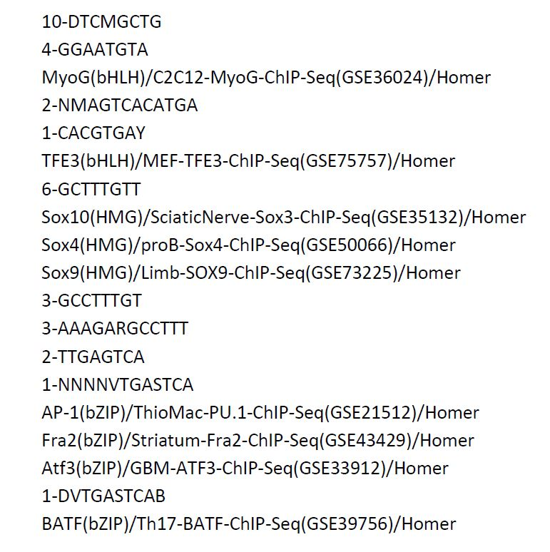

\fontsize{9}{20}

# Introduction

Melanoma is an aggressive cancer with a high level of therapy-resistance due to its high degree of heterogeneity and plasticity. Despite the great efforts put into the field of melanoma treatment, resulting in great advances, many challenges remain. The major challange in fighting melanoma relapse continues to be the tumor heterogeneity, as melanoma comprises a wide variety of phenotypically distinct subpopulations of cancer cells. To be able to adress this issue therapeutically, the underlying mechanisms of heterogeneity need to be characterized. In this paper, a distinction between two major types of melanoma cells is made: invasive and proliferative [@Verfaillie; @Shannan].

Transcriptional reprogramming of melanoma cells in proliferative state into melanoma cells with invasive characteristics is a critical event at the origin of metastatic spreading of melanoma. Invasive cells have acquired the ability to migrate to other tissues, enter the bloodstream and therefore lie at the basis of the metastatic spreading of cancer in the body. While the transitional mechanisms from proliferative to invasive cancer cell are yet to be characterized more extensively, it is sure that one event lies at the basis of this transition: the transcriptional reprogramming of the cell. Studying the involved genes and regulatory elements using various bioinformatics approaches is therefore a hot topic in the area of melanoma research. Decoding the regulatory landscape could result into the ability to push melanoma cells towards a different cell state, which would be an interesting target from a therapeutic point of view [@Verfaillie].

Transcriptomic, open chromatin and histone modification maps of melanoma cultures were constructed, revealing thousands of active cis-regulatory regions, both for proliferative and invasive cells [@Verfaillie]. It should be possible to discern which cis-regulatory regions are useful for the classification of cell states in melanoma samples if such states are truly distinct in terms of regulatory landscape. The aim of the project was the construction of classifiers predicting whether a regulatory region would be active in proliferative or invasive cell states. Another useful insight that would be gained from these classifiers, is which regulatory regions are the most significant for distinguishing between cell states, thus giving information about the underlying mechanisms and the critical genes and regulatory elements involved in cancer cell state transitions. 

Two distinct machine learning techniques were used for the creation of such classifiers, namely the random forests ensemble method and deep learning, making use of convolutional neural networks. Both models were trained on the same training set, which comprises the dataset of active cis-regulatory regions, mentioned hereabove. In this paper, both methods are described and their results are evaluated and compared.

# Methods

All analysis code and raw data, space-permitting, is available at https://github.com/muscovitebob/EnhancerMachineLearning.

## Random forests

Random forest (RF) is a nonparametric tree-based method that builds an ensemble model from random subsets of features.[@Nguyen] RF has shown excellent performance for classification problems, it works well when the number of features is much larger than the number of samples. However, with its typical randomizing mechanism in feature selection, RF models risk having a poor performance when applied to high dimensional data. The main reason for this is that the RF ensemble method uses subset of features randomly sampled from hundreds of features in each iteration. If such a subset is poorly chosen, the choice of nodes for each decision tree is often dominated by uninformative features. This way, trees grown from such a subspace of uninformative features will result in a RF model yielding poor accuracy.[@Nguyen] Aiming at improving the performance of the RF model, a feature selection algorithm filtering out the uninformative features is used.

### Construction of the feature matrix

As random forests do not have feature learning integrated into the training process. Thus, they require the input data to have labelled features. Before the application of RFs to our data was possible, a way to discover motifs was required, which would then be the features used in training the RF model. 

As the raw sequence data was not suitable for training the random forests model, a pipeline to process the sequence data into a usable form, i.e. a feature matrix, was engineered, taking a considerable amount of time. However this investment was justified by the fact that the sequences themselves were not the principal target, but rather whatever recurring motifs would be present. 

### Motif discovery and scoring

To discover motifs in the input fasta sequences, the motif discovery utility Hypergeometric Optimization of Motif EnRichment (HOMER) was used, providing a Perl module \texttt{findMotifs.pl} that allows for the discovery of enriched regulatory motifs in one set of sequences as compared to another set (the background) [@Heinz:2010aa]. As the goal was to compare and contrast the invasive and proliferative cell states, these two sets of sequences were run as backgrounds against each other, identifying the most differential motifs. The results of these two runs can be found in \texttt{HomerOutput}. HOMER analysis served two purposes: it found known motifs and discovered some \textit{de novo} motifs. The motifs returned by HOMER were formatted as position weight matrices (PWM), representing the relative frequencies of each nucleic acid on each position in the motif.

Having identified the ensemble of differentially enriched motifs in these two cell states compared to each other, the Cluster-Buster software was used in order to score the invasive and proliferative sequence sets for each motif, independently [@Frith:2003aa]. This resulted in a log-likelihood score for every motif against every sequence in the sequence sets. The functions for this step of the analysis can be found in \texttt{motif\_processing\_main.sh}. The set of sequences scored for every motif was then assembled into a feature matrix. In such a feature matrix, every row represents a genomic region and every column represents a particular motif, hereafter referred to as features, with the log-likelihood scores as values in this matrix. Also, a \texttt{\_label} column representing the binary outcome variable was inserted, with value 0 representing the invasive cell state and value 1 representing the proliferative cell state. This step of the analysis can be found in \texttt{feature\_matrices.py}, utilising the \texttt{feature\_matrix\_special} method of the \texttt{cbust\_result} class, created in order to handle the output of Cluster-Buster. Thus, a complete data matrix was produced, formatted correctly to be used as input data for a random forests classifier. 

### Feature Selection

The resulting feature matrix contained 333 features. As mentioned above, RF classifiers tend to perform poorly when trained on datasets containing too many features. Thus, methods to reduce the amount of features in the training data for our classifier were required. Two software packages were used in order to obtain a reduction of the amount of features, called MAST and Boruta. 

### MAST

The model-based Analysis of Single Cell Transcriptomics (MAST) R package provides methods and models for handling zero-inflated single cell assay data [@McDavid]. For this project, it is used for likelihood ratio testing via its \texttt{LRT} method. This likelihood ratio test is used to detect the most significant differential features between invasive and proliferative cell states. The R script used for this reformatting and running the likelihood ratio test can be found in \texttt{Mast\_reduce.R}. After running the likelihood ratio test on the feature matrix for every motif, the most significantly differentiatial features (P-value lower than 0.05) were selected. The resulting feature matrix contained 164 feature columns.

### Boruta

Boruta is an all-relevant feature selection method [@Homola]. The algorithm works as follows: first it duplicates the dataset and makes the values shuffling in each column which after that the duplicated dataset is called shadow features. Then an RF classifier is trained on the dataset, from which the importances for each of the features are generated. This is repeated for several iterations (one hundred by default). It trains the original dataset along with the shadow features dataset and checks for each if the real features have higher importance than the best of the shadow features in each iteration. If they do, it records this in a vector of hits and continues on with another iteration. Finally after the predefined set of iterations it generates a table of selected features. This analysis can be found in \texttt{boruta\_reduction.py}.

### Construction of the model

For the construction of the random forests ensemble model, the python package \texttt{scikit-learn} was used, more specifically, its class \texttt{sklearn.ensemble.RandomForestClassifier}, which offers a standard RF classifier. The classifier was constructed using following parameters: \texttt{n\_jobs=-1}, which means using all processors to work in parallel for both fit and predict; \texttt{n\_estimators=1000}, This is the number of trees in this forest, higher number of trees gives better performance but makes fitting slower;  \texttt{max\_depth=None}, the maximum depth of the tree, None means nodes are expanded until all leaves are pure or until all leaves contain less than 'min_samples_split samples'; \texttt{min\_samples\_split=2}, minimum number of samples required to split an internal node (default=2);  \texttt{class\_weight='balanced'}, weights associated with classes, “balanced” mode uses the values of y to automatically adjust weights inversely proportional to class frequencies in the input data as $n\_samples / (n\_classes \times np.bincount(y))$ [@Srivastava].

## Deep learning

### Two architectures

A schematic outline of how a neural network can be used in motif detection is given in [@fig:deeplearningsetup]. After transformation to a 1-hot representation, the DNA sequences can be inputted into a first convolutional layer.   Here a number of kernels, acting as motif scanners, will go over the sequences. This first convolutional layer is then followed by consecutive convolutional layers, each time transforming the input data into more higher level features. At certain points drop out layers and batch normalization are used to reduce the number of parameters, and as a counterweight to overfitting.  At the end, these extracted featured are combined through some dense layers and eventually passed through a softmax layer which outputs a probability distribution over the different classes. During training, the network will adjust its weights in order to optimize the classification task. In the process, the kernel weights of the first convolutional layer will start to resemble the various DNA motifs which are then extracted and compared to a motif database (JASPAR). [@Min].

{#fig:deeplearningsetup}

In this case, two model architectures were compared ([@fig:twomodelarchitectures]).  Model 1 uses 3 CNN’s, Model 2 uses only 1 convolutional layer, and incorporates a recurrent layer (LSTM). A recurrent neural layer can pick up on sequential information and are therefore better suited to capture the context of the motifs (motif syntax).

{#fig:twomodelarchitectures}

Both models were built using the python Keras package on a Tensorflow backend.

### Data augmentation

Even though a neural network can work with raw DNA sequences as input, there are still two issues that need to be overcome.  First, the input to the first convolutional layer needs to be of fixed length, and second, a deep neural network needs a vast amount of training data.  To overcome these 2 issues, a moving window approach (with stride = 20) as in [@Min]  is used ([@fig:dataaugmentation]).   

{#fig:dataaugmentation}

### Training and validation

### Input matrix creation

Starting from 20122 enhancer sequences,  228051 sequences are generated using the data augmentation approach.  The sequences are randomly split in a 70/20/10 fashion (train/test/val).   The loss function was class weighted to counter the fact that the I-label is overrepresented in the input data.  Both the validation and test data were also balanced.

{#fig:trainingmetrics}

### Feature filtering

### Motif extraction

After training, the kernels of the first convolutional layer, can be screened for motifs.  To go from the kernel weights to a proper PSW matrix for a motif, each of the kernels are scored against each of the original DNA sequences.    This score represents the best match of a motif when slided across a particular sequence.   For each motif, the top 100 scoring sequences are stored, and these 100 sequences are then summarized into 1 PSWM.   These PSWM’s are then queried against the JASPAR motif database using TOMTOM [@Gupta]. Only motif matches with a threshold of E < 0.01 are considered significant.

# Results and discussion

## Random Forests

### Selected features

MAST reduced the 333 features in original training set to 164 significant features. Then Boruta takes the reduced feature matrix as input and selected 19 important features[@fig:19selectedBoruta]. The 'Homer' suffix in some features name indicates they are de novo discovered motifs.

{#fig:19selectedBoruta}

### Performance of the model built using reduced features

Afterwards the 19 selected motifs are used as features to train the RF model with the parameters mentioned above. Then this trained classifier is tested on a balanced test set of 3994 sequences (20% of the total). Performance of this model is expressed in terms of accuracy and ROC-characteristics (AUC).
Accuracy is 0.531 can be seen from the accuracy crosstab [@fig:accuracycrosstab]. It is relatively low although it shows the RF model is doing better than random chance (0.5). Besides, most of the predictions belong to class 0.

{#fig:accuracycrosstab}

The ROC curve and AUC evaluation have better results than accuracy,the resulting AUC is 0.67 as can be seen in [@fig:RFroc1], but it is still not ideal. The probable reason might be the unbalance of the training set. There are 4662 class 1 sequences while the class 0 sequences are 11438, almost two times more than class 1, which can make bias in classification. Actually the prediction indeed goes for the majority -- class 0 as shown in the accuracy cross tab. Besides, the low accuracy and AUC could also resulted from the inappropriate selected features when building the RF model. Although boruta is supposed to select all relevant features, but it does not give guarantees considering it is a heuristic procedure designed to find all relevant attributes, including weakly relevant attributes [@Kursa]. Also, there's still a possibility that the truly causative features are not even contained in the original dataset aquired from [@Verfaillie].
In general, however, the final RF model is a good model since it outperforms than the totally by chance model.

{#fig:RFroc1}

### Motif logos

The 19 selected features are: TFE3, MyoG, Sox10, Sox4, Sox9, AP-1, Fra2, Atf3, BATF, 10-DTCMGCTG, 4-GGAATGTA, 2-NMAGTCACATGA, 1-CACGTGAY, 6-GCTTTGTT, 3-GCCTTTGT, 3-AAAGARGCCTTT, 2-TTGAGTCA, 1-NNNNVTGASTCA and 1-DVTGASTCAB. Their logos are shown in [@fig:RFlogos]. They are then ordered by their relative importances as classifiers in the constructed RF model, as shown in [@fig:featureImportances].
Compared with results of [@Verfaillie], both AP-1 and Sox10 are figured out. In RF model they are crucial features (they have relatively high importances can be seen in [@fig:featureImportances]) for the classification, in [@Verfaillie], they are significantly different active regulatory regions in invasive and proliferative regions respectively. 

{#fig:RFlogos}

{#fig:featureImportances}

## Deep learning

### Comparing classification performance

From [@fig:comparingclassperfTab] and [@fig:comparingclassperf]  it is clear that model one outperforms model two. The model using multiple convolutional layers achieves an accuracy that is 9% higher then the model using the recurrent layer. The reason for the weak performance of the LSTM model is not clear. It is demonstrated that deep learing approaches can outperform traditional approaches like SVM in this classification task[@Min]. On the other hand, it is also known that the performance of a neural network can vary quite a lot due to many design choices that need to be made (number of layers, kernels, training time, learning rate, etc.) No attempt was made to fully explore all these degrees of freedom.

{#fig:comparingclassperfTab}

{#fig:comparingclassperf}

### Motifs detected

The motifs detected by both models are shown in [@fig:deeplearnmotifmatches]. SOX10 and AP-1 are considered to be master regulators for the proliferative gene network, and invasise gene network respectively [@Verfaillie]. Both motifs corresponding to those transcription factors are detected in case of model 1.  The SOX-motif shows up as the top motif in model 1, the AP-1 motif is the top motif in model 2. The AP-1 motif is also detected in case of model 2 (ranked 3rd), but the SOX-motif does not show up as a significant hit in case of model 2. The inferior motif detection of model 2 is in line with its weaker classification performance.

{#fig:deeplearnmotifmatches}

# References
